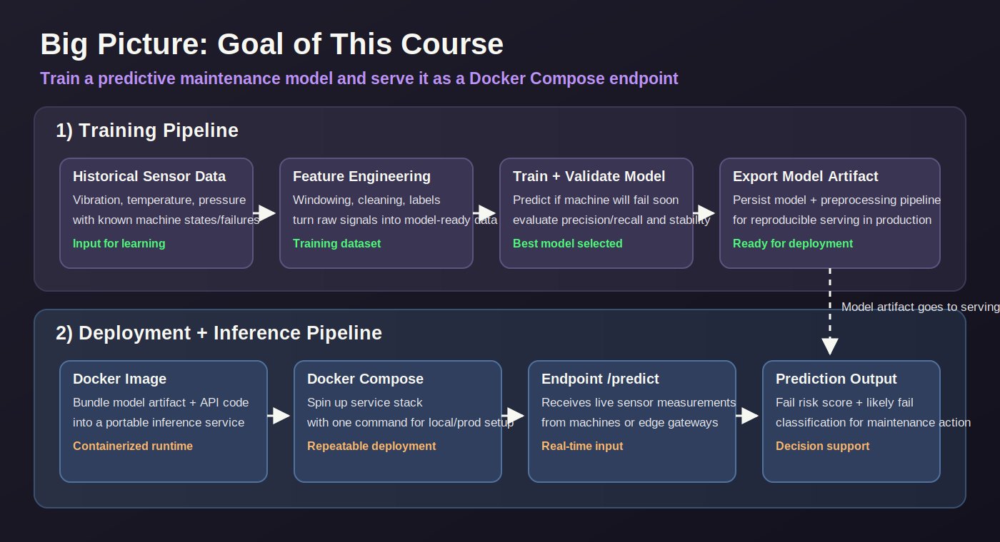

# MKL I4.0 — Predictive Maintenance Demo Project

Student demo project for the **UAS MKL I4.0 Summer Semester 2026** course on machine learning applied to industrial predictive maintenance.

## What we built

The pipeline runs end-to-end from raw SCADA sensor data to a containerised prediction service:

1. **Raw data** — real WinCC SCADA recordings from an industrial ventilator (18 sensor channels at 100 ms sampling)
2. **Pre-processing** — clean missing values, interpolate gaps, remove outliers
3. **Feature engineering** — sliding-window rolling statistics (mean, std, min, max) over 36 feature columns
4. **Model training** — Random Forest classifier trained on Vent4 data; labels the 30-minute window before failure as `pre-failure`
5. **Inference server** — FastAPI endpoint (`/predict`) that loads the trained model and returns predictions + class probabilities
6. **Docker deployment** — model baked into the image at build time; served via Docker Compose

## Modules covered

| Module | Topic |
|--------|-------|
| 5 | FastAPI inference server |
| 6 | Demo client |
| 7 | Docker deployment |
